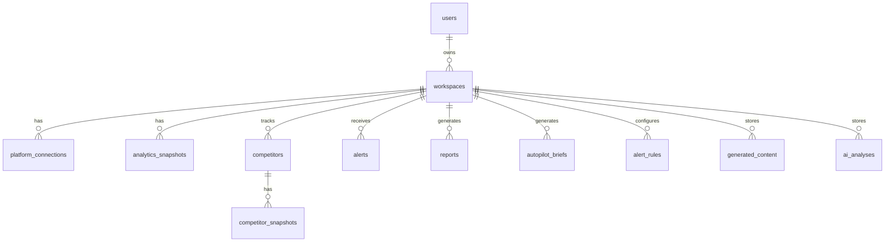

# 4. 🗄️ Database Design

> PostgreSQL — all tables use UUID primary keys and ISO timestamps

---

## Entity Relationship Diagram



---

## Tables

### `users`

| Column | Type | Constraints |
|---|---|---|
| id | UUID | PK, default uuid_generate_v4() |
| email | VARCHAR(255) | UNIQUE, NOT NULL |
| password_hash | VARCHAR(255) | NOT NULL |
| name | VARCHAR(100) | NOT NULL |
| company_name | VARCHAR(200) | |
| created_at | TIMESTAMP | NOT NULL, default NOW() |
| updated_at | TIMESTAMP | NOT NULL, default NOW() |

---

### `workspaces`

One user can have multiple workspaces (e.g., different brands).

| Column | Type | Constraints |
|---|---|---|
| id | UUID | PK |
| user_id | UUID | FK → users.id, NOT NULL |
| name | VARCHAR(200) | NOT NULL |
| mode | VARCHAR(20) | NOT NULL, default 'general' — enum: general, custom |
| goals | JSONB | default '[]' — e.g., ["growth", "engagement"] |
| budget_monthly | DECIMAL(10,2) | |
| telegram_chat_id | VARCHAR(100) | |
| notification_email | VARCHAR(255) | |
| autopilot_enabled | BOOLEAN | default true |
| autopilot_time | TIME | default '08:00' |
| created_at | TIMESTAMP | NOT NULL |
| updated_at | TIMESTAMP | NOT NULL |

---

### `platform_connections`

OAuth tokens for connected social/analytics platforms.

| Column | Type | Constraints |
|---|---|---|
| id | UUID | PK |
| workspace_id | UUID | FK → workspaces.id, NOT NULL |
| platform | VARCHAR(50) | NOT NULL — enum: instagram, linkedin, google_analytics, google_search |
| access_token | TEXT | NOT NULL (encrypted) |
| refresh_token | TEXT | (encrypted) |
| token_expires_at | TIMESTAMP | |
| platform_user_id | VARCHAR(200) | |
| platform_username | VARCHAR(200) | |
| connected_at | TIMESTAMP | NOT NULL |
| status | VARCHAR(20) | default 'active' — enum: active, expired, revoked |

**Unique**: (workspace_id, platform)

---

### `analytics_snapshots`

Daily aggregated metrics per platform.

| Column | Type | Constraints |
|---|---|---|
| id | UUID | PK |
| workspace_id | UUID | FK → workspaces.id, NOT NULL |
| platform | VARCHAR(50) | NOT NULL |
| date | DATE | NOT NULL |
| metrics | JSONB | NOT NULL — schema varies by platform (see below) |
| created_at | TIMESTAMP | NOT NULL |

**Unique**: (workspace_id, platform, date)
**Index**: (workspace_id, date) for range queries

**`metrics` JSONB schema for social**:
```json
{
  "followers": 8500,
  "follower_change": 12,
  "engagement_rate": 4.7,
  "likes": 340,
  "comments": 45,
  "shares": 22,
  "reach": 4500,
  "impressions": 7200,
  "posts_count": 2,
  "top_post_id": "...",
  "worst_post_id": "..."
}
```

**`metrics` JSONB schema for website**:
```json
{
  "visits": 780,
  "unique_visitors": 620,
  "page_views": 2100,
  "bounce_rate": 42.1,
  "avg_session_duration": 185,
  "conversions": 12,
  "conversion_rate": 1.5,
  "top_sources": [{"source": "organic", "visits": 340}]
}
```

**`metrics` JSONB schema for SEO**:
```json
{
  "keywords": [
    {"keyword": "ai marketing", "position": 8, "impressions": 120, "clicks": 9, "ctr": 7.5}
  ],
  "avg_position": 14.3,
  "total_impressions": 4500,
  "total_clicks": 320
}
```

---

### `competitors`

| Column | Type | Constraints |
|---|---|---|
| id | UUID | PK |
| workspace_id | UUID | FK → workspaces.id, NOT NULL |
| name | VARCHAR(200) | NOT NULL |
| platforms | JSONB | NOT NULL — e.g., {"instagram": "@handle", "website": "https://..."} |
| auto_detected | BOOLEAN | default false |
| tracking_since | TIMESTAMP | NOT NULL |
| status | VARCHAR(20) | default 'active' — enum: active, paused, archived |

---

### `competitor_snapshots`

Daily competitor metrics (mirrors analytics_snapshots structure).

| Column | Type | Constraints |
|---|---|---|
| id | UUID | PK |
| competitor_id | UUID | FK → competitors.id, NOT NULL |
| date | DATE | NOT NULL |
| metrics | JSONB | NOT NULL — posting_frequency, engagement_rate, content_types, follower_count |
| campaigns_detected | JSONB | default '[]' |
| created_at | TIMESTAMP | NOT NULL |

**Unique**: (competitor_id, date)

---

### `ai_analyses`

Stored AI copilot outputs.

| Column | Type | Constraints |
|---|---|---|
| id | UUID | PK |
| workspace_id | UUID | FK → workspaces.id, NOT NULL |
| focus | VARCHAR(20) | NOT NULL — all, social, website, seo |
| period | VARCHAR(10) | NOT NULL — 7d, 30d, 90d |
| insights | JSONB | NOT NULL |
| actions | JSONB | NOT NULL |
| content_ideas | JSONB | NOT NULL |
| model_used | VARCHAR(20) | groq, gemini |
| tokens_used | INTEGER | |
| created_at | TIMESTAMP | NOT NULL |

**Index**: (workspace_id, created_at DESC)

---

### `generated_content`

| Column | Type | Constraints |
|---|---|---|
| id | UUID | PK |
| workspace_id | UUID | FK → workspaces.id, NOT NULL |
| platform | VARCHAR(50) | NOT NULL |
| type | VARCHAR(20) | NOT NULL — caption, post_idea, campaign |
| tone | VARCHAR(20) | NOT NULL |
| content | TEXT | NOT NULL |
| hashtags | JSONB | default '[]' |
| rating | SMALLINT | 1-5, nullable |
| was_used | BOOLEAN | default false |
| created_at | TIMESTAMP | NOT NULL |

---

### `alerts`

| Column | Type | Constraints |
|---|---|---|
| id | UUID | PK |
| workspace_id | UUID | FK → workspaces.id, NOT NULL |
| type | VARCHAR(30) | NOT NULL — engagement_drop, spike, competitor_activity, custom_rule |
| severity | VARCHAR(10) | NOT NULL — critical, high, medium, low |
| title | VARCHAR(300) | NOT NULL |
| message | TEXT | NOT NULL |
| suggested_action | TEXT | |
| read | BOOLEAN | default false |
| rule_id | UUID | FK → alert_rules.id, nullable |
| created_at | TIMESTAMP | NOT NULL |

**Index**: (workspace_id, read, created_at DESC)

---

### `alert_rules`

User-defined alert rules (Custom Mode).

| Column | Type | Constraints |
|---|---|---|
| id | UUID | PK |
| workspace_id | UUID | FK → workspaces.id, NOT NULL |
| name | VARCHAR(200) | NOT NULL |
| condition | JSONB | NOT NULL — {"metric": "...", "operator": "...", "threshold": ..., "period": "..."} |
| actions | JSONB | NOT NULL — ["notify_telegram", "suggest_action"] |
| enabled | BOOLEAN | default true |
| last_triggered_at | TIMESTAMP | |
| created_at | TIMESTAMP | NOT NULL |

---

### `reports`

| Column | Type | Constraints |
|---|---|---|
| id | UUID | PK |
| workspace_id | UUID | FK → workspaces.id, NOT NULL |
| period_start | DATE | NOT NULL |
| period_end | DATE | NOT NULL |
| file_path | VARCHAR(500) | NOT NULL — S3 key or local path |
| summary | JSONB | High-level stats for quick display |
| generated_at | TIMESTAMP | NOT NULL |

---

### `autopilot_briefs`

| Column | Type | Constraints |
|---|---|---|
| id | UUID | PK |
| workspace_id | UUID | FK → workspaces.id, NOT NULL |
| date | DATE | NOT NULL |
| top_actions | JSONB | NOT NULL — array of 3 actions |
| content_idea | JSONB | NOT NULL |
| competitor_insight | JSONB | NOT NULL |
| delivered_via | JSONB | default '["dashboard"]' |
| created_at | TIMESTAMP | NOT NULL |

**Unique**: (workspace_id, date)
