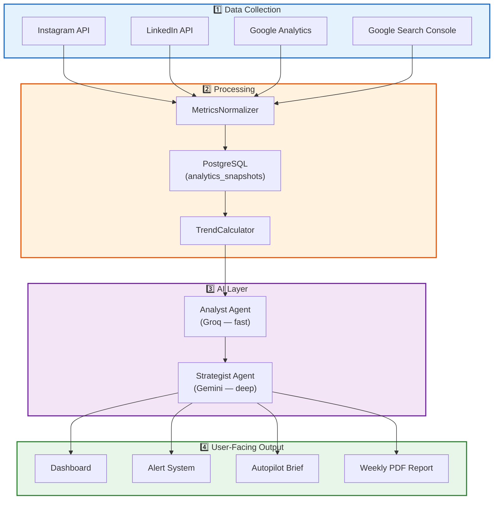

# 5. 🔄 System Flow

---

## Core Data Pipeline



---

## Flow 1: User Opens Dashboard

```
User opens dashboard
    │
    ▼
Frontend calls GET /analytics/overview?period=7d
    │
    ▼
Backend → AnalyticsService.get_overview()
    │
    ├── Query analytics_snapshots (last 7 days)
    ├── TrendCalculator.compute_trends()
    └── Return aggregated response
    │
    ▼
Frontend renders charts + metrics
    │
    ▼
Frontend calls GET /alerts?status=unread (sidebar badge)
    │
    ▼
Frontend calls GET /autopilot/today (hero card)
```

---

## Flow 2: AI Analysis (On-Demand)

```
User clicks "Analyze" button
    │
    ▼
Frontend → POST /ai/analyze { focus: "all", period: "30d", goals: ["growth"] }
    │
    ▼
Backend → AIService.analyze()
    │
    ├── 1. Fetch last 30d analytics_snapshots
    ├── 2. Fetch competitor_snapshots
    ├── 3. Fetch last AI analysis (for context continuity)
    │
    ├── 4. AnalystAgent.process(data)           ← Groq API (fast)
    │       ├── Build prompt with real data injected
    │       ├── Call Groq (Llama 3) for pattern detection
    │       └── Parse JSON response → insights[]
    │
    ├── 5. StrategistAgent.strategize(insights)  ← Gemini API (deep)
    │       ├── Build prompt with insights + goals + history
    │       ├── Call Gemini for strategy generation
    │       └── Parse JSON response → actions[] + content_ideas[]
    │
    ├── 6. Save to ai_analyses table
    └── 7. Return structured response
    │
    ▼
Frontend displays insights cards + action items
```

---

## Flow 3: Alert Detection (Background)

```
Celery Beat → Every 30 minutes → alert_checker task
    │
    ▼
For each workspace with active connections:
    │
    ├── 1. Fetch latest analytics_snapshot
    ├── 2. Fetch 30-day rolling baseline
    │
    ├── 3. AnomalyDetector.check()
    │       ├── Z-score calculation for each metric
    │       ├── If |z| > 2.0 → anomaly detected
    │       └── Classify: engagement_drop | spike
    │
    ├── 4. CompetitorTracker.check_activity()
    │       ├── Compare today's competitor_snapshot vs yesterday
    │       └── Detect: posting_burst | viral_content | campaign_start
    │
    ├── 5. RuleEngine.evaluate(alert_rules)
    │       └── Check user-defined IF/THEN rules
    │
    ├── 6. For each detected alert:
    │       ├── ActionSuggester.suggest(alert)    ← Groq (fast, 1-line)
    │       ├── AlertThrottler.should_send?(alert)
    │       ├── Save to alerts table
    │       └── AlertDispatcher.send()
    │             ├── Telegram: send via Bot API
    │             └── Email: send via SMTP/SendGrid
    │
    ▼
User receives notification within 30 min of event
```

---

## Flow 4: Weekly Report Generation (Background)

```
Celery Beat → Every Sunday 00:00 UTC → report_generator task
    │
    ▼
For each workspace:
    │
    ├── 1. ReportDataAggregator.collect(period=last_7_days)
    │       ├── Aggregate analytics_snapshots
    │       ├── Aggregate competitor_snapshots
    │       ├── Fetch ai_analyses from the week
    │       └── Fetch alerts from the week
    │
    ├── 2. ReportNarrativeGenerator.generate()    ← Gemini API (deep reasoning)
    │       ├── Build prompt: "Write a comprehensive weekly marketing report..."
    │       ├── Include: performance data, insights, competitor intel
    │       ├── Request sections: summary, key insights, competitor analysis,
    │       │   next week plan, recommendations
    │       └── Parse structured narrative response
    │
    ├── 3. ChartRenderer.render()
    │       ├── Engagement trend line chart
    │       ├── Traffic bar chart
    │       ├── Competitor comparison table
    │       └── SEO keyword position chart
    │
    ├── 4. PDFBuilder.build()
    │       ├── Apply branded template
    │       ├── Embed charts as images
    │       ├── Insert narrative sections
    │       └── Generate PDF file
    │
    ├── 5. Save PDF to file storage
    ├── 6. Create reports table record
    │
    └── 7. Notify user
          ├── Dashboard notification
          ├── Telegram: "Your weekly report is ready 📊"
          └── Email: attach PDF
```

---

## Flow 5: Autopilot Daily Briefing (Background)

```
Celery Beat → Every day at workspace.autopilot_time → autopilot_runner task
    │
    ▼
For each workspace where autopilot_enabled = true:
    │
    ├── 1. Fetch last 24h analytics_snapshots
    ├── 2. Fetch latest competitor_snapshots
    ├── 3. Fetch unresolved alerts
    ├── 4. Fetch yesterday's autopilot_brief (for continuity)
    │
    ├── 5. DailyOrchestrator.run()
    │       ├── AnalystAgent.quick_scan(24h_data)     ← Groq (fast)
    │       ├── StrategistAgent.daily_brief(scan)      ← Groq (fast, constrained output)
    │       ├── ContentAgent.daily_idea(context)        ← Groq (fast)
    │       └── CompetitorAgent.daily_insight(data)     ← Groq (fast)
    │
    ├── 6. PriorityRanker.rank(all_suggestions) → top 3
    ├── 7. AutopilotFormatter.format() → { top_actions, content_idea, competitor_insight }
    │
    ├── 8. Save to autopilot_briefs table
    └── 9. DeliveryManager.deliver()
          ├── Dashboard: push via WebSocket/polling
          ├── Telegram: formatted brief message
          └── Email: summary email
```

---

## Flow 6: Content Generation (On-Demand)

```
User fills content form → clicks "Generate"
    │
    ▼
Frontend → POST /content/generate { platform, type, tone, topic, count }
    │
    ▼
Backend → ContentService.generate()
    │
    ├── 1. Fetch user's top performing posts (for style reference)
    ├── 2. Fetch latest AI insights (for relevance)
    │
    ├── 3. ContentAgent.generate()
    │       ├── For quick drafts (caption, single post):
    │       │   └── Groq API (low latency, < 2 sec)
    │       ├── For campaign plans (multi-post series):
    │       │   └── Gemini API (deeper reasoning)
    │       │
    │       ├── ToneAdapter.apply(tone)
    │       ├── PlatformFormatter.format(platform)
    │       └── Parse response → generated_content[]
    │
    ├── 4. Save to generated_content table
    └── 5. Return formatted content
    │
    ▼
Frontend displays generated content cards
User can: copy, edit, rate (1-5), mark as "used"
```
