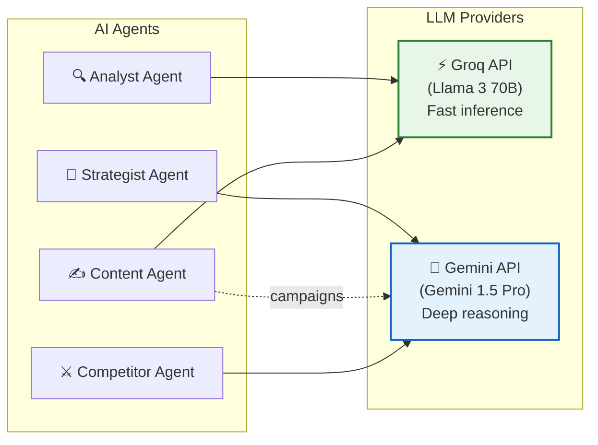

# 6. 🤖 AI Architecture

---

## Agent Overview



---

## Agent Definitions

### 🔍 Analyst Agent

| Attribute | Detail |
|---|---|
| **Role** | Pattern detective — finds what's happening in the data |
| **LLM** | **Groq** (Llama 3 70B) — needs speed for real-time scans |
| **Input** | Structured metrics data (analytics_snapshots as JSON) |
| **Output** | `insights[]` — each with type, title, description, confidence, data_points |
| **Usage Points** | On-demand analysis, alert action suggestions, autopilot daily scan |

**How prompts interact with data**:
```
System: You are a marketing data analyst. Analyze the following metrics 
        and identify patterns, anomalies, and opportunities.
        
        Respond in JSON: { "insights": [{ "type": "opportunity|problem|trend", 
        "title": "...", "description": "...", "confidence": 0.0-1.0, 
        "data_points": ["..."] }] }

User:   ## Analytics Data (Last 30 Days)
        Platform: Instagram
        Followers: 8500 (+320, +3.9%)
        Engagement Rate: [daily_values_array]
        ...
        
        ## Current Goals
        Primary: growth
        Secondary: engagement
```

---

### 🧠 Strategist Agent

| Attribute | Detail |
|---|---|
| **Role** | Strategic advisor — decides what to DO about insights |
| **LLM** | **Gemini** (1.5 Pro) — needs deep reasoning for strategy |
| **Input** | Analyst insights + user goals + historical actions + competitor data |
| **Output** | `actions[]` with priority, reasoning, expected_impact; `content_ideas[]` |
| **Usage Points** | On-demand analysis (stage 2), weekly report narrative, campaign planning |

**How prompts interact with data**:
```
System: You are a senior marketing strategist. Given the analyst's insights,
        user goals, and competitive landscape, produce specific, actionable 
        strategies. Do NOT give generic advice. Every recommendation must 
        reference specific data points.
        
        Respond in JSON: { 
          "actions": [{ "priority": "high|medium|low", "action": "...", 
                        "reasoning": "...", "expected_impact": "..." }],
          "content_ideas": [{ "platform": "...", "idea": "...", 
                              "tone": "...", "optimal_time": "..." }]
        }

User:   ## Analyst Insights
        [injected insights from Analyst Agent]
        
        ## Competitor Landscape
        CompetitorX: 3x more reels, 2x higher reach
        CompetitorY: Running spring sale campaign (8 posts, 7.2% engagement)
        
        ## User Goals
        Primary: Growth (target: +15% followers/month)
        Budget: $5,000/month
        
        ## Past Actions Taken
        [last 3 strategy outputs for continuity]
```

---

### ✍️ Content Agent

| Attribute | Detail |
|---|---|
| **Role** | Creative copywriter — generates marketing content |
| **LLM** | **Groq** for quick drafts (captions, single posts); **Gemini** for campaign plans |
| **Input** | Platform, tone, topic, brand context, top-performing post patterns |
| **Output** | Content text + hashtags + engagement estimate |
| **Usage Points** | Content generation endpoint, autopilot daily idea |

**How prompts interact with data**:
```
System: You are a {tone} copywriter for {platform}. Write engaging marketing 
        content. Study the user's top-performing posts for style patterns.
        
        Platform rules:
        - Instagram: max 2200 chars, 30 hashtags, emoji-friendly
        - LinkedIn: max 3000 chars, 3-5 hashtags, professional

User:   ## Task
        Generate {count} {type} about: "{topic}"
        Tone: {tone}
        
        ## Top Performing Posts (for style reference)
        1. "🚀 Just launched..." → 8.7% engagement
        2. "Behind the scenes..." → 7.2% engagement
        
        ## Brand Context
        Company: {company_name}
        Industry: {industry}
        
        ## Current Trending Topics
        [injected from latest AI analysis]
```

---

### ⚔️ Competitor Agent

| Attribute | Detail |
|---|---|
| **Role** | Competitive intelligence analyst — explains WHY competitors win |
| **LLM** | **Gemini** (1.5 Pro) — needs deep comparative reasoning |
| **Input** | Competitor snapshots + user's own metrics for comparison |
| **Output** | "Why winning" narrative + counter-strategies |
| **Usage Points** | Competitor analysis endpoint, weekly report competitor section, autopilot insight |

**How prompts interact with data**:
```
System: You are a competitive intelligence analyst. Compare the user's 
        marketing performance against their competitor. Explain specifically 
        WHY the competitor is outperforming and provide counter-strategies.

User:   ## Your Performance (Last 30d)
        Engagement Rate: 4.7%
        Posting Frequency: 3/week
        Content Mix: 60% static, 30% carousel, 10% reels
        Follower Growth: +3.9%
        
        ## Competitor: {competitor_name} (Last 30d)
        Engagement Rate: 6.1%
        Posting Frequency: 6/week
        Content Mix: 20% static, 35% carousel, 45% reels
        Follower Growth: +5.3%
        Campaigns: Spring Sale (8 posts, 7.2% avg engagement)
```

---

## LLM Provider Strategy

### ⚡ Groq (Fast Inference)

| Use Case | Why Groq |
|---|---|
| Alert action suggestions | Must generate within seconds of anomaly detection |
| Autopilot daily scan | Runs for ALL workspaces — speed = cost savings |
| Quick content drafts | User expects < 3 sec response time |
| Analyst Agent data scans | Pattern matching is well-suited for fast LLMs |
| Real-time chat suggestions | If future chat feature added |

**Config**: Llama 3 70B, temperature 0.3, max_tokens 2000, JSON mode enabled

---

### 🧬 Gemini (Deep Reasoning)

| Use Case | Why Gemini |
|---|---|
| Strategy generation | Requires multi-step reasoning across data sources |
| Weekly report narratives | Needs coherent, long-form analysis writing |
| Competitor "why winning" | Comparative analysis requires deeper reasoning |
| Campaign planning | Multi-post campaign design needs creative depth |
| Complex content (campaigns) | Multi-part content needs strategic coherence |

**Config**: Gemini 1.5 Pro, temperature 0.5, max_tokens 4000, structured output

---

## Shared Architecture: BaseAgent

All agents inherit from `BaseAgent`:

```
BaseAgent (abstract)
├── build_prompt(data, template) → str
├── call_llm(prompt, provider) → raw_response
├── parse_response(raw) → structured_dict
├── retry_on_failure(max=3) → structured_dict
└── log_usage(tokens, latency, model) → void

AnalystAgent(BaseAgent)
├── process(analytics_data) → insights[]
└── quick_scan(24h_data) → brief_insights[]

StrategistAgent(BaseAgent)
├── strategize(insights, goals, history) → actions[] + content_ideas[]
└── daily_brief(scan_results) → brief_actions[]

ContentAgent(BaseAgent)
├── generate(platform, tone, topic, context) → content[]
└── daily_idea(context) → single_content

CompetitorAgent(BaseAgent)
├── analyze(competitor_data, user_data) → analysis
└── daily_insight(competitor_snapshots) → single_insight
```

---

## Prompt Management

Prompts live in `app/ai/prompts/` as Python files with template strings:

```
prompts/
├── analyst.py         # ANALYST_SYSTEM, ANALYST_USER_TEMPLATE, ANALYST_QUICK_SCAN
├── strategist.py      # STRATEGIST_SYSTEM, STRATEGIST_USER_TEMPLATE, STRATEGIST_DAILY
├── content.py         # CONTENT_SYSTEM, CONTENT_USER_TEMPLATE (per platform/tone combos)
└── competitor.py      # COMPETITOR_SYSTEM, COMPETITOR_USER_TEMPLATE, COMPETITOR_DAILY
```

Each template uses Python f-string or `.format()` with named placeholders for data injection. This keeps prompts version-controlled and easily testable.
