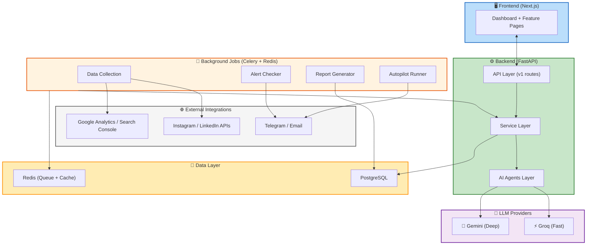

# 🚀 AI Marketing Co-Pilot — System Architecture

> **Project**: OffGrid — AI-Powered Marketing Co-Pilot Platform
> **Type**: Greenfield (New Project)
> **Designed**: 2026-04-10
> **Status**: INCEPTION — Application Design Complete

---

## Architecture Overview

---

## Design Documents

This architecture is decomposed into 7 detailed design documents:

| # | Document | Description |
|---|---|---|
| 1 | [01-project-structure.md](./01-project-structure.md) | Full project folder tree — frontend, backend, API, services, AI agents, jobs, integrations |
| 2 | [02-modules.md](./02-modules.md) | 7 module breakdowns — purpose, inputs, outputs, internal components |
| 3 | [03-api-design.md](./03-api-design.md) | All REST endpoints grouped by feature — with full request/response payloads |
| 4 | [04-database-design.md](./04-database-design.md) | 11 PostgreSQL tables — columns, types, relationships, JSONB schemas, indexes |
| 5 | [05-system-flow.md](./05-system-flow.md) | 6 end-to-end flows — dashboard, AI analysis, alerts, reports, autopilot, content |
| 6 | [06-ai-architecture.md](./06-ai-architecture.md) | 4 AI agents — Groq vs Gemini strategy, prompt templates, BaseAgent design |
| 7 | [07-mvp-plan.md](./07-mvp-plan.md) | 36-hour MVP plan — 4 phases, core vs optional, technical shortcuts |

---

## Key Design Decisions

### Dual-LLM Strategy
- **Groq** (Llama 3 70B): Alerts, quick analysis, content drafts, autopilot scans — latency < 2 sec
- **Gemini** (1.5 Pro): Strategies, weekly reports, competitor analysis, campaign plans — depth > speed

### JSONB for Metrics
Analytics and competitor data uses PostgreSQL JSONB columns instead of rigid schemas. This allows each platform's unique metrics to be stored without schema migrations when adding new platforms.

### Modular Agent Architecture
All AI agents inherit from `BaseAgent` with standardized `build_prompt → call_llm → parse_response` pipeline. Adding a new agent (e.g., SEO Agent) requires only creating a new subclass + prompt templates.

### Background Job Strategy
- **Celery Beat** schedules: data collection (hourly), alert checking (30 min), autopilot (daily), reports (weekly)
- **Redis** serves dual purpose: Celery message broker + response cache for repeated queries

### Two Product Modes
- **General Mode**: Zero-config, auto-insights, plug-and-play
- **Custom Mode**: User-defined goals, budget constraints, IF/THEN alert rules, workflow automation

---

## Tech Stack Summary

| Layer | Technology | Purpose |
|---|---|---|
| Frontend | Next.js (App Router) | SSR dashboard, TypeScript, Recharts/Chart.js |
| Backend | FastAPI | REST API, async support, Pydantic validation |
| Database | PostgreSQL | Persistent storage, JSONB for flexible schemas |
| Queue | Celery + Redis | Background jobs, scheduled tasks |
| AI (Fast) | Groq API | Real-time suggestions, alerts, quick content |
| AI (Deep) | Gemini API | Strategy, reports, competitor analysis |
| Notifications | Telegram Bot + Email | Alert delivery, report notifications |
| PDF | ReportLab / WeasyPrint | Weekly report generation |
